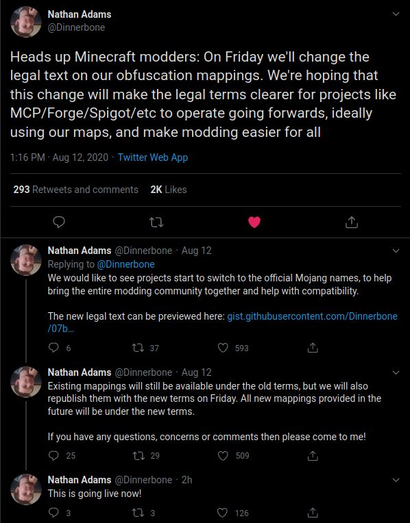

# A brief statement on Minecraft Mapping data

See [Update August 2020](# Update August 2020) for an updated statement for the change in August 2020.

## Overview

On 4th September, 2019, Mojang published [snapshot 19w36a][1]. A feature highlight is the following:

> In an effort to help make modding the game easier, we have decided to publish our game obfuscation maps with all future releases of the game, starting today. This means that anyone who is interested may deobfuscate the game and find their way around the code without needing to spend a few months figuring out what’s what. It is our hope that mod authors and mod framework authors use these files to augment their updating processes that they have today. These mappings will always be available, instantly and immediately as part of every newly released version. This does not, however, change the existing restrictions on what you may or may not do with our game code or assets. The links to the obfuscation mappings are included as part of the version manifest json, and may be automatically pulled for any given version.

On first glance, this looks amazing! We have finally been given public access to the obfuscation data used by Mojang themselves.
However, this data comes with a very significant problem:

>  Prefixed to every obfuscation map is the following legal disclaimer:
>
> © 2019 Microsoft Corporation. All rights reserved. This information is provided “as-is” and you bear the risk of using it. This information does not provide you with any legal rights to any intellectual property in any Microsoft product. You may copy and use this information for your internal, reference purposes. Microsoft makes no warranties, express or implied, with respect to the information provided here.

## The legal problem

Firstly, a **huge great big fat caveat**. This is not legal advice. This is an extremely pessimistic view of what was clearly intended as a goodwill gesture from Mojang and Microsoft.

However, today's friendly demeanor does not represent all possible future states. We have to exercise the most extreme caution when we really want something and are seemingly given it, out of the blue.

Finally, legal matters are boring, pragmatic, but ultimately very important. Many members of the modding community are adults leading normal lives. The impact of a high profile copyright violation case would be devastating to them. Modding has lots of unilluminated legal areas. Let us not walk into obvious well lit legal traps.

### `internal, reference purposes`

There is a very significant legal problem with this statement. It seems that any use of this information in a public fashion will render them in direct violation of an explicitly stated
copyright notice expressing the desire *not* to use this information in any public fashion. This means that any project exposing this mapping data in a public fashion, such as by publishing
source using this naming scheme would be in direct violation of Microsoft's license.

Is this a valid legal analysis? I don't know. But the safest approach seems to be that we should continue as if this information had never existed, for *public* consumption. This discussion comes from that vantage point.

Note that private formal arrangements have existed for sharing similar data with Minecraft Mod platform projects prior to this information release. We take it on good faith that Microsoft permits that use to continue, as it does
not result in published artifacts containing this data in any fashion.

## What does this mean

This means that Forge will not be:
1. Publishing an "official mapping" version of Forge.
2. Providing an "officially mapped" deobfuscation map to be used at runtime.
3. Supporting mods distributed using "officially mapped" naming in their compiled names.

The MCP project will:
1. Continue to exist (sorry Searge!). It was needed anyway, but it will remain in its current form in its entirety.
2. Strive to avoid accepting names from the official naming into the MCP repository from now on. We cannot completely avoid pollution from
official names, but we should try and avoid it where we can.
3. The MCP project recommends similar safeguards be put in place for our fellow naming project, Yarn, used by Fabric.

No mod should:
1. Knowingly publish source or artifacts that use these names in any form.

## Clarification

Myself and LexManos have reached out to Mojang in an effort to clarify the license above. We have only received "we realize there's a problem here and we're looking into it" in response. We hope to receive clarification in future that mods and forge are able to refer these names in their source and compiled forms _as published artifacts_, thereby releasing us from this binding.

It is a pity that they failed to consult with us before this move, as we could have quickly apprised them of the _real_ uses of this information, as "internal reference" is very much a poison chalice, and offers nothing we 
didn't already have, and potentially puts in jeopardy abilities we previously _did_ have.

## TLDR
The mapping information has the potential to be truly transformative, and I'm certain that Mojang and Microsoft had nothing but those intentions in mind when they did this. However, in my opinion, the mapping information with this license is legal poison, and should not be used in any published artifact by any mod or mod framework. I sincerely hope Mojang can clarify this and remove the poison, to allow impactful transformation of modding.

[1]: https://www.minecraft.net/en-us/article/minecraft-snapshot-19w36a


# Update August 2020

On 12th August 2020, Dinnerbone published this [tweet thread][2]. 

The amended license terms mentioned are as follows:

```
© 2020 Microsoft Corporation. All rights reserved. These mappings are provided "as-is" and you bear the risk of using them. You may copy and use the mappings for development purposes, but you may not redistribute the mappings complete and unmodified. Microsoft makes no warranties, express or implied, with respect to the mappings provided here.  Use and modification of source code for Minecraft: Java Edition is governed by the Minecraft End User License Agreement available at https://account.mojang.com/documents/minecraft_eula. 
```

This was set live on Friday 14th August, with the text above unaltered.

## Some good news?

One thing from my original analysis has changed, with this change. They are _probably_ now useable to distribute the source code to a mod. 
In other words, it's my opinion that you could publish the _source code_ to your mod, onto an open public forum, with these names referenced, and not be in violation of the new license terms, as source code is pretty clearly "development purposes".

## Development purposes

This new term is the key issue here. What does it mean? All development related activities? That's a pretty nebulous specification, in my opinion.

* What about playing the mod, when compiled with these names? Is that development?
* What about distributing the mod, when compiled with these names? Is that development?
* What about runtime deobfuscation of the game to these names? Is that development?

All of these are potentially problematic when it comes to the transformative uses discussed above. Interoperability goals are only achieved in this transformative case, and I don't believe the license is explicitly supporting this transformative case.

## External documentation

Some have said that things like the tweet from Dinnerbone above (and related tweets), are implicit authorization that our uses are good. These are an excellent sign of strong good will from Mojang, and I welcome it, and hope that we can continue to foster goodwill going forwards. However, legal licenses don't care about external statements of goodwill. They may count before a Judge, and as such, are probably a strong indicator that we'd prevail in a legal motion, but the whole point is that I don't think any of our community would have the financial muscle to try and enter into a prolonged legal battle with an adversarial future Microsoft. Therefore, we have to take the _most pessimistic view_ of any legal text, and said text _has_ to be considered on it's own, without reference to any supporting documentation, be they tweets, letters, or otherwise.

## Legal discussions

I am going to be honest and state that I had been working with Mojang since several months prior to this change in the hopes that we would fix this problem to my satisfaction. This update was not my desired end-state. It was something that was a _move in the right direction_, but I stood and still stand hopeful that we can move further.

My latest proposal is that use of this file be governed under the EULA. The game is All rights reserved, however, we mod with permission from the EULA. This is an extension to modding, why does this need separate legal governance? Specifically, I would like to see the license change to "use of this file in modding is governed by the EULA terms on modding. You may not redistribute it directly."


## Conclusion (August 2020)

I still harbour hope that Mojang actually does want to work to _actually_ address this problem, and this is not the final word on this matter.

[2]: https://twitter.com/Dinnerbone/status/1293597326561488897?s=20